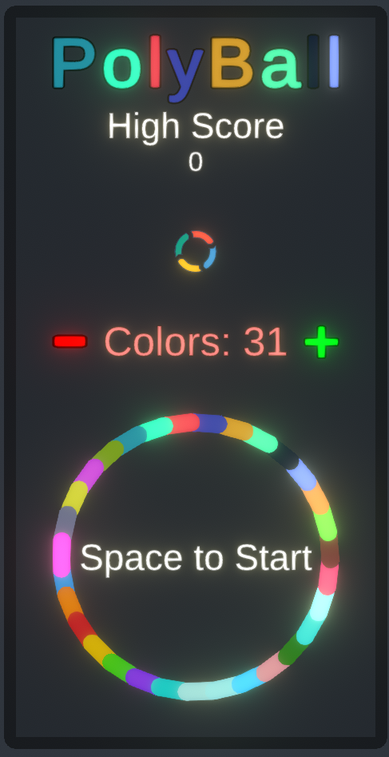

# 🎮 PolyBall

    
    

Welcome to PolyBall - where geometry meets fun!

## 📸 Game Preview

| Main Menu | Gameplay |
|:-------------------------:|:-------------------------:|
|  |  |
| **Polygon Shapes** | **Controls Tutorial** |
|  |  |

## ✨ Features

- **Dynamic Polygon Creation**: Create stunning polygons with 3, 5, 7, or more sides
- **Color Customization**: Add your personal touch with a vibrant color palette
- **Skill-Based Gameplay**: Master the art of timing and precision
- **High Score System**: Separate high scores for each polygon configuration
- **Smooth Controls**: Intuitive keyboard-based gameplay

## 🎯 How to Play

1. **Start by Customizing Your Polygon**:

   - Use the arrow keys to adjust your polygon in the main screen
   - The number of sides will always be odd (3, 5, 7, etc.)
   - Each configuration has its own high score to beat!

2. **Master the Controls**:

### Main Screen Controls

| Action            | Button        |
| ----------------- | ------------- |
| Add Color         | Right Arrow   |
| Remove Last Color | Left Arrow    |
| Randomize Colors  | Up/Down Arrow |

### In-Game Controls

| Action          | Button      |
| --------------- | ----------- |
| Rotate Left     | Left Arrow  |
| Rotate Right    | Right Arrow |
| Smash Ball Down | Space Bar   |

## 📈 Scoring System

- Each polygon configuration (3-sided, 5-sided, etc.) has its own separate high score list
- Score increases based on the number of lines drawn (+1 point for every two lines)
- Challenge yourself to master each polygon type!

## 🗺️ Roadmap

Here's what i'm planning for future updates (one day i hope):

### Short Term

- [ ] Mobile port for Android devices
- [ ] Touch controls optimization
- [ ] Additional sound effects and music
- [ ] Visual effects for scoring
- [ ] Achievement system
- [ ] Basic shop system with:
  - Custom ball skins
  - Line effects
  - Trail effects

### Medium Term

- [ ] iOS port
- [ ] Online leaderboards
- [ ] New game modes
- [ ] Power-ups system
- [ ] Custom color schemes
- [ ] Extended shop features:
  - Particle effect customization
  - Special ball behaviors
  - Custom polygon patterns
  - Animation effects for lines
  - Sound effect packs

### Long Term

- [ ] Level editor
- [ ] Custom polygon creation
- [ ] Cross-platform save system
- [ ] Social features (share scores, challenges)
- [ ] Advanced customization system:
  - Premium effects bundles
  - Challenge-exclusive cosmetics
  - Interactive ball skins
  - Dynamic line patterns
  - Custom background themes
  - Special event cosmetics

### Shop System Plans

- [ ] Virtual currency system
  - In-game coins earned through play
  - Premium currency option
- [ ] Unlockable content:
  - Progress-based unlocks
  - Achievement-based rewards
  - Daily challenges for rare items
- [ ] Customization categories:
  - Ball customization
    - Basic shapes
    - Animated skins
    - Particle trails
    - Size variations
    - Special effects
  - Line customization
    - Pattern styles
    - Glow effects
    - Animation types
    - Thickness options
    - Color patterns
  - Visual effects
    - Death animations
    - Score popups
    - Background effects
    - Color transition effects
    - Impact effects

### Technical Improvements

- [ ] Performance optimization for mobile devices
- [ ] Code refactoring for better maintainability
- [ ] Enhanced physics system
- [ ] Better UI scaling for different screen sizes
- [ ] Improved save system
- [ ] Shop system backend
  - Secure transaction system
  - Cloud save for purchases
  - Cross-platform inventory sync

## 🤝 Contributing

Feel free to fork this project and submit your pull requests! Whether it's new features, bug fixes, or documentation improvements - all contributions are welcome!

## 📝 License

This project is open source and available under the MIT License.

---

Made with 📐 and ❤️

